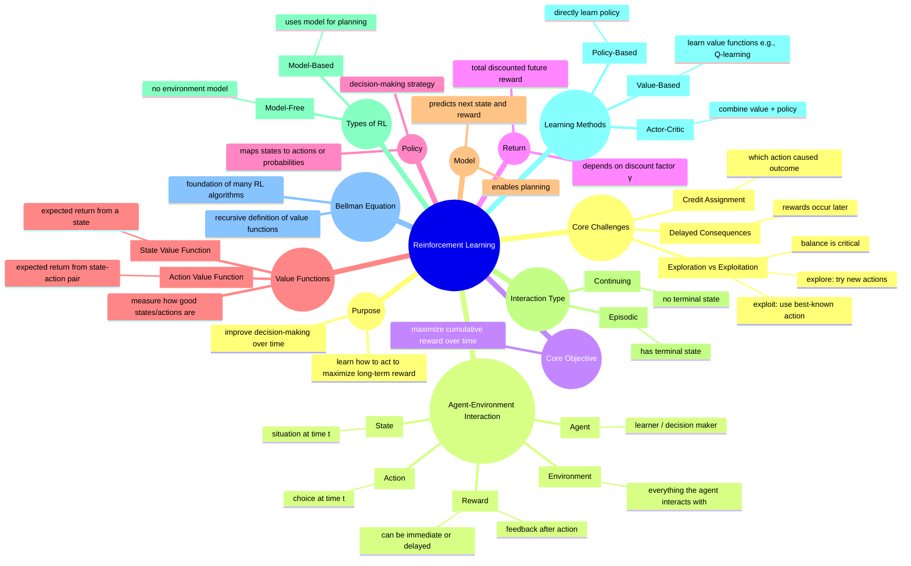

# What Reinforcement Learning Is

## 1. Why It Matters

Reinforcement Learning (RL) is fundamentally different from standard supervised learning.

- In **supervised learning**, you are given the correct answer.
- In **reinforcement learning**, you are *not* told the correct action.

Instead, you:
- take actions
- observe consequences
- receive rewards (often delayed)

### Why RL is important

Many real-world problems follow this pattern:

- Controlling a robot  
- Playing games  
- Recommendation systems with long-term engagement  
- Dialogue systems  
- Resource allocation  
- Sequential decision-making under uncertainty  

### Core Question

> **How should an agent act over time to maximize cumulative reward?**

---

## 2. Intuition

Think of RL as **learning through interaction**.

A child learns to ride a bicycle by:
- trying
- failing
- correcting
- improving over time

An RL agent works the same way:

1. Observe the current situation  
2. Take an action  
3. Environment responds  
4. Receive reward  
5. Update understanding  

### Key Challenge: Delayed Rewards

If you win a chess game after 20 moves:
- Which move actually mattered?

This is called the **credit assignment problem**.

---

### Exploration vs Exploitation

- **Exploration** → Try new actions  
- **Exploitation** → Use best-known action  

> RL is about balancing both.

---

## 3. Formalism

### Core Components

- **Agent**  
- **Environment**  
- **State** $S_t$  
- **Action** $A_t$  
- **Reward** $R_{t+1}$  

### Interaction Loop

$$
S_t \rightarrow A_t \rightarrow R_{t+1}, S_{t+1}
$$

---

### Policy

$$
\pi(a \mid s) = \Pr(A_t = a \mid S_t = s)
$$

---

### Return

#### Episodic Tasks

$$
G_t = R_{t+1} + R_{t+2} + \cdots + R_T
$$

#### Continuing Tasks (Discounted)

$$
G_t = R_{t+1} + \gamma R_{t+2} + \gamma^2 R_{t+3} + \cdots
$$

Where:
- $G_t$ = return  
- $\gamma \in [0,1]$ = discount factor  

---

### Value Functions

#### State-Value Function

$$
v_\pi(s) = \mathbb{E}_\pi [ G_t \mid S_t = s ]
$$

#### Action-Value Function

$$
q_\pi(s, a) = \mathbb{E}_\pi [ G_t \mid S_t = s, A_t = a ]
$$

---

### Key Insight

- **Policy** → what to do  
- **Value** → how good it is  

---

## 4. Example: Maze Problem

### Returns

- Short path (3 steps):
$$
-1 -1 + 10 = 8
$$

- Long path (8 steps):
$$
-1 -1 -1 -1 -1 -1 -1 + 10 = 3
$$

---

## 5. Comparison with Other Fields

### Supervised Learning
- Has correct labels  
- RL does not  

### Optimization
- Objective is known  
- RL learns via interaction  

### Control Theory
- Strong overlap  
- RL handles unknown dynamics  

---

## 6. Common Confusions

### Reward vs Return
- Reward → immediate  
- Return → cumulative  

### Policy vs Value
- Policy → action selection  
- Value → evaluation  

### RL = Trial and Error?
> Structured trial and error.

### Exploration Only at Start?
No.

### Immediate Reward = Best Action?
False.

---

## Final Thought

> **Learning to act when consequences unfold over time.**

## Summary

## Notes

### Reward vs return
    - Reward = immediate scalar signal at one time step
    - Return = total future reward from a time onward
    So reward is a local signal, return is a long-term quantity.
### Policy
    A policy is the agent’s rule for selecting actions, often written as probabilities over actions given a state.
### Meaning of $𝑣_𝜋(𝑠)$
This is exactly right: $𝑣_𝜋(s)=𝐸_𝜋[𝐺_𝑡∣𝑆_𝑡=𝑠]$

    It means the expected long-term return starting from state 𝑠, if we continue following policy 𝜋.
### Why delayed reward is hard
    when reward comes later, it is hard to know which earlier action or state caused it.
Example:
if I win a game after 50 moves, which move deserves credit?
That is the real difficulty.
### Why exploration is necessary
    Exploration is necessary because the agent does not initially know which actions are best, so it must try different actions to gather information.