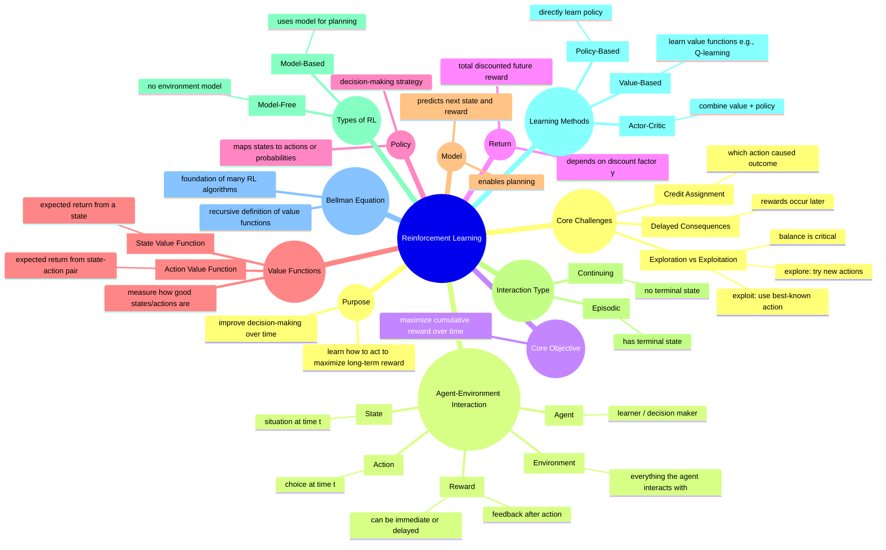

# What Reinforcement Learning *Really* Is

## 1. Why It Matters

Reinforcement Learning (RL) is fundamentally different from most machine learning paradigms.

* In **supervised learning**, you are given the correct answer.
* In **reinforcement learning**, you are *never* told the correct action.

Instead, the agent must:

* take actions
* observe consequences
* receive rewards (often delayed)
* learn from experience

---

### Why RL is Important

Many real-world problems naturally follow this pattern:

* Controlling robots
* Playing games (Chess, Go, Atari)
* Recommendation systems (YouTube, Netflix)
* Dialogue systems
* Resource allocation
* Autonomous driving
* Any **sequential decision-making under uncertainty**

---

### Core Question

> **How should an agent act over time to maximize cumulative reward?**

This single question defines the entire field.

---

## 2. Intuition: Learning Through Interaction

Reinforcement Learning is best understood as **learning by doing**.

A child learning to ride a bicycle:

* tries → fails → adjusts → improves

No one provides exact instructions for every movement.

Similarly, an RL agent:

1. Observes the current situation
2. Takes an action
3. The environment responds
4. Receives a reward
5. Updates its behavior

---

### The Hard Part: Delayed Rewards

In many problems, rewards do not come immediately.

Example:

* You make a move in chess
* You win **20 moves later**

Which move was responsible?

> This is the **credit assignment problem** — one of the deepest challenges in RL.

---

### Exploration vs Exploitation

This is the central tension in RL:

* **Exploration** → Try new actions to gain information
* **Exploitation** → Use current knowledge to maximize reward

If you:

* only explore → you waste reward
* only exploit → you may miss better strategies

> RL is about balancing both *continuously*, not just at the beginning.

---

## 3. Formal Framework

### Core Components

An RL system consists of:

* **Agent** — the decision-maker
* **Environment** — everything the agent interacts with
* **State** $S_t$ — current situation
* **Action** $A_t$ — agent’s choice
* **Reward** $R_{t+1}$ — feedback

---

### Interaction Loop

$$
S_t \rightarrow A_t \rightarrow R_{t+1}, S_{t+1}
$$

This loop repeats continuously.

---

## 4. Policy — Behavior of the Agent

A **policy** defines how the agent behaves:

$$
\pi(a \mid s) = \Pr(A_t = a \mid S_t = s)
$$

* Deterministic → always pick same action
* Stochastic → assign probabilities to actions

> A policy is simply: **“what would I do in this situation?”**

---

## 5. Return — What We Actually Care About

The agent does not optimize immediate reward alone.

It optimizes **return**, i.e., total future reward.

---

### Episodic Tasks

$$
G_t = R_{t+1} + R_{t+2} + \cdots + R_T
$$

---

### Continuing Tasks (Discounted)

$$
G_t = R_{t+1} + \gamma R_{t+2} + \gamma^2 R_{t+3} + \cdots
$$

Where:

* $G_t$: return
* $\gamma \in [0,1]$: **discount factor**

---

### Intuition of Discounting

> **Future rewards matter less than immediate rewards.**

* $\gamma = 0$ → only immediate reward matters
* $\gamma \approx 1$ → long-term rewards matter

Think of it as:

> “How far into the future should the agent care?”

---

## 6. Value Functions — Measuring Goodness

Value functions estimate **how good something is**.

---

### State-Value Function

$$
v_\pi(s) = \mathbb{E}_\pi [ G_t \mid S_t = s ]
$$

> “How good is it to be in this state?”

---

### Action-Value Function

$$
q_\pi(s, a) = \mathbb{E}_\pi [ G_t \mid S_t = s, A_t = a ]
$$

> “How good is taking this action in this state?”

---

### Key Insight

* **Policy** → decides
* **Value** → evaluates

Most RL algorithms are about improving one using the other.

---

## 7. Example: Maze Problem

Agent gets:

* ( +10 ) at goal
* ( -1 ) per step

---

### Short Path (3 steps)

$$
-1 -1 +10 = 8
$$

---

### Long Path (8 steps)

$$
-1 -1 -1 -1 -1 -1 -1 +10 = 3
$$

---

### Insight

Even though every step looks similar locally:

> Some paths are better because they lead to higher **long-term return**.

---

## 8. How RL Differs from Other Fields

### Supervised Learning

* Correct labels provided
* No exploration

### Optimization

* Objective directly known
* RL learns through interaction

### Control Theory

* Known dynamics assumed
* RL works even when environment is unknown

---

## 9. Common Confusions (Cleared)

### Reward vs Return

* Reward → immediate
* Return → cumulative

---

### Policy vs Value

* Policy → what to do
* Value → how good it is

---

### “RL is just trial and error”

Not quite.

> It is **structured, guided trial and error** using estimation and optimization.

---

### “Exploration is only needed at the beginning”

False.

Exploration may be needed throughout learning.

---

### “Higher immediate reward = better action”

False.

> Some actions sacrifice short-term reward for long-term gain.

---

## 10. The Core Idea to Remember

> **Reinforcement Learning is about learning how to act when consequences unfold over time.**

Or even simpler:

> **Act → Observe → Learn → Improve**

---

## 11. Mental Model (Never Forget This)

```
Agent → Action → Environment → Reward → Update → Repeat
```

Everything in RL is built on this loop.

---

## Final Thought

Reinforcement Learning is not about memorizing formulas.

It is about understanding:

* uncertainty
* delayed consequences
* decision-making over time

> **You are not learning answers — you are learning how to act.**


## Summary



## Notes

### Reward vs return
    - Reward = immediate scalar signal at one time step
    - Return = total future reward from a time onward
    So reward is a local signal, return is a long-term quantity.
### Policy
    A policy is the agent’s rule for selecting actions, often written as probabilities over actions given a state.
### Meaning of $𝑣_𝜋(𝑠)$
This is exactly right: $𝑣_𝜋(s)=𝐸_𝜋[𝐺_𝑡∣𝑆_𝑡=𝑠]$

    It means the expected long-term return starting from state 𝑠, if we continue following policy 𝜋.
### Why delayed reward is hard
    when reward comes later, it is hard to know which earlier action or state caused it.
Example:
if I win a game after 50 moves, which move deserves credit?
That is the real difficulty.
### Why exploration is necessary
    Exploration is necessary because the agent does not initially know which actions are best, so it must try different actions to gather information.