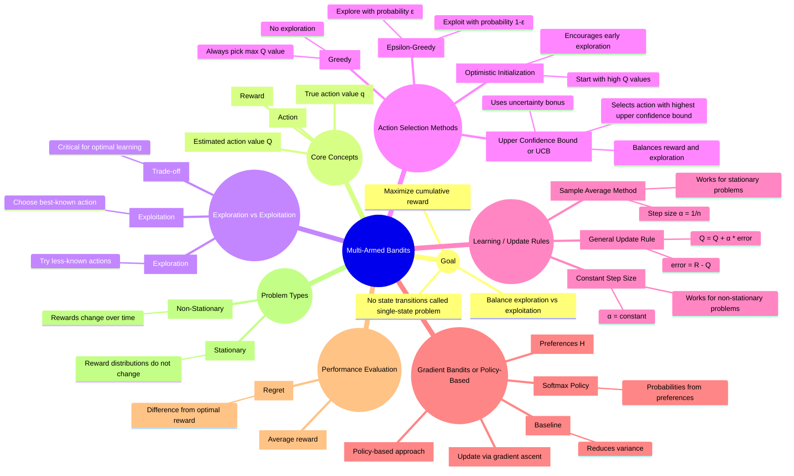

# Multi-Armed Bandits

## 1. Why It Matters

This chapter exists because **bandits isolate the exploration–exploitation tradeoff** in its purest form.

Before full Reinforcement Learning (RL), where actions affect future states, bandits study a simpler setting:

- No state transitions  
- Each action gives a reward from an unknown distribution  
- Goal: learn which action is best  

### Why Bandits Are Important

They help us understand:

- Action-value estimation  
- Incremental updates  
- Exploration strategies  
- Optimism  
- Confidence bounds  
- Preference-based learning  

> Many core RL ideas first appear here in a simpler form.

---

## 2. Intuition

Imagine **k slot machines** in a casino.

- Each machine gives rewards from an unknown distribution  
- Each pull gives a reward  
- Goal: maximize total reward over time  

### Key Questions

- Should I use the best-known arm?  
- Should I try others in case I'm wrong?  
- How much exploration is enough?  

This is the **exploration–exploitation dilemma**.

---

### Why Bandits Are Simpler Than RL

- No next state  
- Actions don’t affect future situations  
- Only immediate reward matters  

 Bandits are a **stepping stone to full RL**.

---

## 3. Formalism

### Problem Setup

We have **k actions**:

$$
a = 1, 2, ..., k
$$

Each action has a true value:

$$
q^*(a) = \mathbb{E}[R_t \mid A_t = a]
$$

But this value is **unknown**.

We estimate it using:

$$
Q_t(a)
$$

---

### Greedy Action Selection

$$
A_t = \arg\max_a Q_t(a)
$$

 Problem: Can get stuck with bad early estimates.

---

### ε-Greedy Strategy

- With probability \(1 - ε\): choose best action  
- With probability \(ε\): choose random action  

 Ensures continuous exploration.

---

### Action-Value Estimation (Sample Average)

$$
Q_t(a) = \frac{\sum_{i=1}^{t-1} R_i \cdot \mathbf{1}(A_i = a)}{N_t(a)}
$$

Where:
- $N_t(a)$: number of times action \(a\) was selected  

---

### Incremental Update Rule

Instead of storing all rewards:

$$
Q_{n+1} = Q_n + \frac{1}{n}(R_n - Q_n)
$$

### Interpretation

- Old estimate: $Q_n$ 
- Error: $R_n - Q_n$  
- Step size: \(1/n\)  

> **New = Old + Step Size × Error**

---

### General Step-Size Form

$$
Q_{n+1} = Q_n + \alpha_n (R_n - Q_n)
$$

- $\alpha_n = 1/n$ → sample average  
- $\alpha_n = \alpha$ → constant step size  

 Constant step size is better for **nonstationary problems**.

---

### Optimistic Initial Values

Set:

$$
Q_1(a) = \text{large positive value}
$$

 Forces early exploration because all actions look promising.

---

### Upper Confidence Bound (UCB)

$$
A_t = \arg\max_a \left[ Q_t(a) + c \sqrt{\frac{\ln t}{N_t(a)}} \right]
$$

Where:
- \(c > 0\): exploration strength  

 Balances:
- High reward  
- High uncertainty  

---

### Gradient Bandits

Instead of values, learn **preferences** \(H_t(a)\).

#### Softmax Policy

$$
\pi_t(a) = \frac{e^{H_t(a)}}{\sum_b e^{H_t(b)}}
$$

---

### Preference Update

For selected action $A_t$:

$$
H_{t+1}(A_t) = H_t(A_t) + \alpha (R_t - \bar{R}_t)(1 - \pi_t(A_t))
$$

For non-selected actions:

$$
H_{t+1}(a) = H_t(a) - \alpha (R_t - \bar{R}_t)\pi_t(a)
$$

 First step toward **policy gradient methods**.

---

## 4. Example

### Given Data

- Action 1 rewards: 1, 3, 2  
- Action 2 rewards: 4, 0  

### Estimates

$$
Q(1) = \frac{1 + 3 + 2}{3} = 2
$$

$$
Q(2) = \frac{4 + 0}{2} = 2
$$

---

### Update Example

New reward for action 1 = 5

#### Sample Average Update

$$
Q_4(1) = 2 + \frac{1}{4}(5 - 2) = 2.75
$$

---

### Constant Step-Size Update

If \(\alpha = 0.1\):

$$
Q_{\text{new}} = 2 + 0.1(5 - 2) = 2.3
$$

---

### Key Insight

- Sample average → exact mean  
- Constant step size → adapts to change  

---

## 5. Comparison

### Bandits vs RL

- Bandits → no state transitions  
- RL → long-term state-dependent decisions  

---

### Greedy vs ε-Greedy

- Greedy → no exploration  
- ε-Greedy → random exploration  

---

### Sample Average vs Constant Step Size

- Sample average → best for stationary  
- Constant step size → best for changing environments  

---

### Optimistic Initialization vs ε-Greedy

- Optimistic → early exploration  
- ε-Greedy → continuous exploration  

---

### UCB vs ε-Greedy

- ε-Greedy → random exploration  
- UCB → uncertainty-driven exploration  

 UCB is smarter.

---

### Gradient vs Value-Based Methods

- Value-based → estimate \(Q(a)\)  
- Gradient → learn policy directly  

 Leads to:
- Value-based RL  
- Policy-based RL  

---

## 6. Common Confusions

### 1. Bandits = RL?
 No — no state transitions in bandits.

---

### 2. Exploration = Random forever?
 No — good exploration reduces uncertainty efficiently.

---

### 3. Incremental Update = Just a trick?
 No — it is a **fundamental RL principle**:

$$
\text{estimate} \leftarrow \text{estimate} + \text{step size} \times \text{error}
$$

---

### 4. Optimistic Initialization Solves Exploration?
 Only helps early learning.

---

### 5. Constant Step Size is Inferior?
 No — better in nonstationary settings.

---

### 6. UCB is Random?
 No — it is **uncertainty-driven**.

---

### 7. Gradient Bandits Estimate Values?
 No — they optimize policies directly.

---

## Final Thought

> **Bandits are the simplest setting where learning from reward becomes meaningful.**

They form the foundation for everything that follows in Reinforcement Learning.

## Summary

## Notes

### Bandits isolate what?
    The bandit problem isolates the exploration–exploitation tradeoff.
### Why can greedy fail?
    Because early random outcomes may make a bad action look good, and a greedy method may never revisit alternatives.
### Meaning of $Q_{n+1}​=Q_n​+ α(R_n​−Q_n​)$
This is one of the most important equations in RL

    Take your old estimate, and move it a little toward the newly observed reward.
Break it down:
- $𝑄_𝑛$ : current estimate
- $R_n$: new observed reward
- $𝑅_𝑛 − 𝑄_𝑛$: error in your estimate
- α: how much you trust the new information

So if the reward is larger than expected, increase the estimate.

If the reward is smaller than expected, decrease it.

This is the universal RL update template:

> new estimate = old estimate + step size × error

### Why constant step size helps in nonstationary problems
    In nonstationary problems, the true action values can change over time, so old data becomes less reliable.
If we use sample averaging, all past data is weighted heavily forever.
That makes the estimate slow to adapt.

If we use a constant step size 
𝛼
α, recent rewards get more influence.
So the estimate can track changes.

Intuition
- sample average = “long memory”
- constant α = “shorter memory, more adaptive”

### UCB vs ε-greedy
Key difference:
- ε-greedy explores randomly
- UCB explores based on uncertainty

That is a huge conceptual difference.

Intuition

> ε-greedy says:

    “Once in a while, I’ll try something random.”

> UCB says:

    “I should try actions that either look good or are still uncertain.”

So UCB is more informed and targeted.

### Gradient bandits vs action-value methods

Key difference:

- Action-value methods learn estimates Q(a), then choose actions based on those estimates.
- Gradient bandits directly learn preferences or a policy over actions.

So:

Value-based view
1. estimate how good each action is
2. choose action using those estimates
Policy-based view
1. directly parameterize action probabilities
2. update those probabilities toward better actions

This matters later when we study policy gradients.