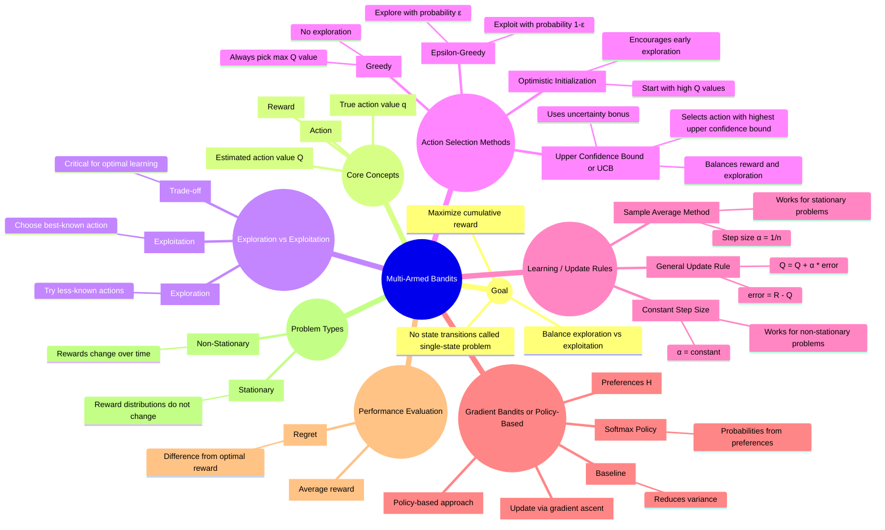

# Multi-Armed Bandits (Deep Understanding Guide)

## 1. Why It Matters

This chapter exists because **bandits isolate the exploration–exploitation tradeoff in its purest form**.

Before full Reinforcement Learning (RL), where actions influence future states, bandits give us a simpler world:

* No state transitions
* Each action produces a reward from an unknown distribution
* Goal: **learn which action is best over time**

---

### Why Bandits Are Important

Bandits are not just a toy problem — they teach the *core mechanics* of RL:

* Estimating action values
* Learning from experience
* Balancing exploration vs exploitation
* Designing exploration strategies
* Understanding uncertainty
* Moving toward policy-based learning

> Almost every major RL idea first appears here in a simpler, cleaner form.

---

## 2. Intuition

Imagine you are in a casino with **k slot machines (arms)**.

* Each machine gives rewards differently
* You don’t know which is best
* You can only learn by playing

---

### The Core Dilemma

At every step, you must decide:

* **Exploit** → choose the best-known machine
* **Explore** → try other machines to gather information

---

### The Central Question

> “How much should I trust what I know vs what I don’t know yet?”

This is the **exploration–exploitation tradeoff**.

---

### Why Bandits Are Simpler Than RL

* No state changes
* No long-term consequences
* Only immediate reward matters

> Bandits remove complexity so you can focus purely on **decision-making under uncertainty**.

---

## 3. Formal Setup

We have **k actions**:

$$
a = 1, 2, ..., k
$$

Each action has a true (unknown) value:

$$
q^*(a) = \mathbb{E}[R_t \mid A_t = a]
$$

We estimate it using:

$$
Q_t(a)
$$

---

### Goal

> Learn $Q_t(a)$ accurately and choose actions that maximize total reward.

---

## 4. Action Selection Methods

---

### 4.1 Greedy Method

$$
A_t = \arg\max_a Q_t(a)
$$

* Always choose the current best estimate

🚨 Problem:

* Early wrong estimates → permanently wrong behavior

---

### 4.2 ε-Greedy Strategy

* With probability $1 - \varepsilon$: choose best action
* With probability $ \varepsilon $: choose randomly

---

### Intuition

> “Mostly trust what I know, but sometimes explore.”

---

### Strength

* Simple and effective
* Ensures continuous exploration

### Weakness

* Exploration is **random**, not intelligent

---

### 4.3 Optimistic Initialization

Initialize:

$$
Q_1(a) = \text{large value}
$$

---

### Intuition

> “Assume everything is good until proven otherwise.”

* Forces the agent to try all actions
* Exploration happens naturally

---

### Limitation

* Works mainly in early stages
* No continued exploration

---

### 4.4 Upper Confidence Bound (UCB)

$$
A_t = \arg\max_a \left[ Q_t(a) + c \sqrt{\frac{\ln t}{N_t(a)}} \right]
$$

---

### Intuition

* First term → what looks good
* Second term → what is uncertain

> “Choose actions that are either promising or insufficiently explored.”

---

### Strength

* Smart, directed exploration

### Weakness

* Requires keeping track of counts
* Slightly more complex

---

## 5. Learning Action Values

---

### 5.1 Sample Average Method

$$
Q_t(a) = \frac{\sum_{i=1}^{t-1} R_i \cdot \mathbf{1}(A_i = a)}{N_t(a)}
$$

---

### Interpretation

* Treat all past rewards equally
* Converges to true value (if stationary)

---

### 5.2 Incremental Update Rule

$$
Q_{n+1} = Q_n + \frac{1}{n}(R_n - Q_n)
$$

---

### Key Insight

> **New estimate = Old estimate + Step size × Error**

Where:

* Error = $R_n - Q_n$

---

### 5.3 General Step-Size Form

$$
Q_{n+1} = Q_n + \alpha_n (R_n - Q_n)
$$

---

### Intuition

* Large α → learn fast
* Small α → learn slowly

---

### Important Insight

* $\alpha = 1/n$ → remembers entire history
* $\alpha = \text{constant}$ → emphasizes recent data

---

### When to Use What?

| Setting              | Best Choice        |
| -------------------- | ------------------ |
| Stationary           | Sample average     |
| Changing environment | Constant step size |

---

## 6. Gradient Bandits (Policy-Based View)

Instead of learning values (Q(a)), we learn **preferences** (H(a)).

---

### Softmax Policy

$$
\pi(a) = \frac{e^{H(a)}}{\sum_b e^{H(b)}}
$$

---

### Intuition

* Higher preference → higher probability
* Lower preference → lower probability

> We directly learn *how likely* we should choose each action.

---

### Preference Update

Selected action:
$$
H_{t+1}​(At​) = H_t​(At​)+ α(R_t​ − \bar R_t​)(1−π_t​(A_t​))
$$

$H(a) \uparrow \quad \text{if reward is better than average}$

Non-selected actions:

$$
H_{t+1}​(a)=H_t​(a)− α(R_t​ − \bar R_t​) π_t​(a)
$$

$H(a) \downarrow$

where $\bar 𝑅_t$ is a baseline, often average reward.

---

### Role of Baseline

$$
R - \bar{R}
$$

* Positive → increase preference
* Negative → decrease preference

> Baseline stabilizes learning by reducing noise.

---

## 7. Numerical Example

Given:

* Action 1 rewards: 1, 3, 2
* Action 2 rewards: 4, 0

---

### Estimates

$$
Q(1) = 2, \quad Q(2) = 2
$$

---

### New Reward for Action 1 = 5

---

#### Sample Average

$$
Q = \frac{1+3+2+5}{4} = 2.75
$$

---

#### Constant Step Size (α = 0.1)

$$
Q = 2 + 0.1(5 - 2) = 2.3
$$

---

### Insight

* Sample average → accurate but slow
* Constant α → faster, adaptable

---

## 8. Performance Evaluation

---

### Average Reward

$$
\frac{1}{T} \sum_{t=1}^{T} R_t
$$

Measures how well the agent performs overall.

---

### Regret

$$
\text{Regret} = T q^* - \sum_{t=1}^{T} R_t
$$

---

### Intuition

* Low regret → learned quickly
* High regret → wasted time exploring poorly

---

## 9. Comparisons (Quick Summary)

| Concept    | Key Idea                       |
| ---------- | ------------------------------ |
| Greedy     | No exploration                 |
| ε-Greedy   | Random exploration             |
| Optimistic | Early forced exploration       |
| UCB        | Uncertainty-driven exploration |
| Gradient   | Learn probabilities directly   |

---

## 10. Common Confusions

---

### Bandits = RL?

❌ No
Bandits have no states or long-term effects.

---

### Exploration = Random forever?

❌ No
Good exploration becomes more focused over time.

---

### Incremental Update = Just a trick?

❌ No

$$
\text{estimate} \leftarrow \text{estimate} + \text{step size} \times \text{error}
$$

This is the **core learning rule in RL**.

---

### Optimistic Initialization Solves Exploration?

❌ Only early-stage exploration.

---

### UCB is Random?

❌ No
It is guided by **uncertainty**.

---

### Gradient Bandits Estimate Values?

❌ No
They directly learn policies.

---

## Final Insight

> **Bandits are the simplest environment where learning from reward becomes meaningful.**

They teach:

* how to estimate
* how to explore
* how to improve decisions

Everything in Reinforcement Learning builds on these ideas.

## Summary

## Notes

### Bandits isolate what?
    The bandit problem isolates the exploration–exploitation tradeoff.
### Why can greedy fail?
    Because early random outcomes may make a bad action look good, and a greedy method may never revisit alternatives.
### Meaning of $Q_{n+1}​=Q_n​+ α(R_n​−Q_n​)$
This is one of the most important equations in RL

    Take your old estimate, and move it a little toward the newly observed reward.
Break it down:
- $𝑄_𝑛$ : current estimate
- $R_n$: new observed reward
- $𝑅_𝑛 − 𝑄_𝑛$: error in your estimate
- α: how much you trust the new information

So if the reward is larger than expected, increase the estimate.

If the reward is smaller than expected, decrease it.

This is the universal RL update template:

> new estimate = old estimate + step size × error

### Why constant step size helps in nonstationary problems
    In nonstationary problems, the true action values can change over time, so old data becomes less reliable.
If we use sample averaging, all past data is weighted heavily forever.
That makes the estimate slow to adapt.

If we use a constant step size 
𝛼
α, recent rewards get more influence.
So the estimate can track changes.

Intuition
- sample average = “long memory”
- constant α = “shorter memory, more adaptive”

### UCB vs ε-greedy
Key difference:
- ε-greedy explores randomly
- UCB explores based on uncertainty

That is a huge conceptual difference.

Intuition

> ε-greedy says:

    “Once in a while, I’ll try something random.”

> UCB says:

    “I should try actions that either look good or are still uncertain.”

So UCB is more informed and targeted.

### Gradient bandits vs action-value methods

Key difference:

- Action-value methods learn estimates Q(a), then choose actions based on those estimates.
- Gradient bandits directly learn preferences or a policy over actions.

So:

Value-based view
1. estimate how good each action is
2. choose action using those estimates
Policy-based view
1. directly parameterize action probabilities
2. update those probabilities toward better actions

This matters later when we study policy gradients.